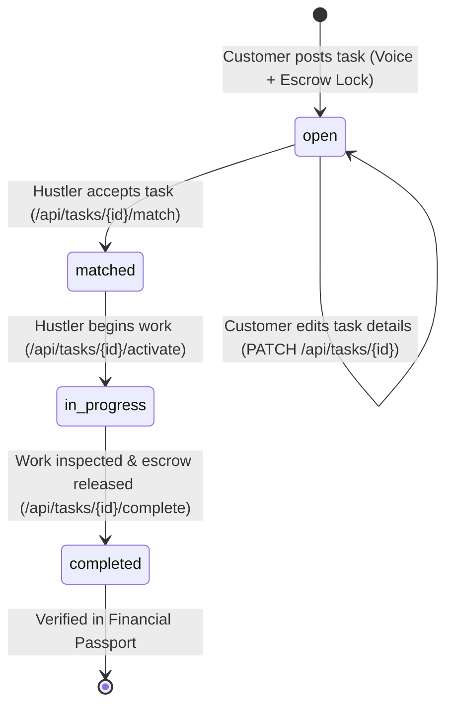
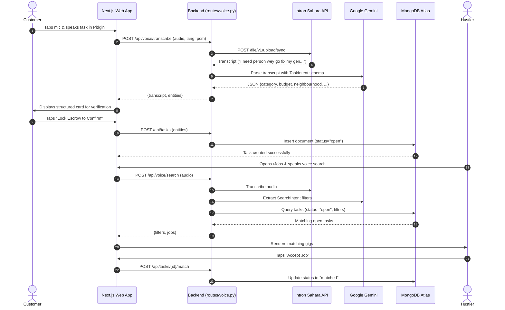

# AreaHustle — Technical Architecture Specification

## 1. High-Level Architecture Overview

AreaHustle decouples high-friction human voice capture from rigid relational marketplace records using an asynchronous pipeline:

```
┌─────────────────────────────────────────────────────────────┐
│                      CLIENT TIER                            │
│               Next.js 16 Web Application                    │
│   ┌───────────────────────────┐ ┌───────────────────────┐   │
│   │   Customer Post-Task UI   │ │   Hustler Job Feed    │   │
│   │   - MediaRecorder API     │ │   - Voice Search Mic  │   │
│   │   - Waveform Canvas       │ │   - Filter Badges     │   │
│   │   - Escrow Settlement Card│ │   - Gig Claim Action  │   │
│   └─────────────┬─────────────┘ └───────────┬───────────┘   │
└─────────────────┼───────────────────────────┼───────────────┘
                  │ Multipart Audio (WAV/WebM)│
                  ▼                           ▼
┌─────────────────────────────────────────────────────────────┐
│                      BACKEND API                            │
│                    FastAPI Server                           │
│   ┌─────────────────────────────────────────────────────┐   │
│   │  routes/voice.py                                    │   │
│   │  - POST /api/voice/transcribe                       │   │
│   │  - POST /api/voice/search                           │   │
│   └───────────────┬─────────────────────┬───────────────┘   │
│                   │                     │                   │
│         ┌─────────▼─────────┐ ┌─────────▼─────────┐         │
│         │ sahara_client.py  │ │gemini_extractor.py│         │
│         │ (Intron Voice API)│ │ (Google Gemini)   │         │
│         └─────────┬─────────┘ └─────────┬─────────┘         │
└───────────────────┼─────────────────────┼───────────────────┘
                    │                     │
          ┌─────────▼────────┐  ┌─────────▼────────┐
          │  Intron Sahara   │  │  Google Gemini   │
          │  Voice STT Sync  │  │  Flash JSON Mode │
          │  (pcm / yo)      │  │  (Task Intent)   │
          └──────────────────┘  └──────────────────┘
                    │                     │
                    └──────────┬──────────┘
                               ▼
                    ┌─────────────────────┐
                    │  MongoDB Atlas      │
                    │  Database:          │
                    │  areahustle_fintech │
                    │  - tasks            │
                    │  - users            │
                    │  - transactions     │
                    └─────────────────────┘
```

---

## 2. Audio Processing & Speech-to-Text Pipeline

### Intron Sahara STT Specification
- **Base Endpoint**: `https://infer.voice.intron.io`
- **Sync Upload Path**: `POST /file/v1/upload/sync`
- **Authentication**: `Authorization: Bearer <SAHARA_API_KEY>`
- **Supported Formats**: `wav`, `webm`, `mp3`, `ogg`, `m4a`, `flac`
- **Target Formats**: 16kHz mono 16-bit PCM WAV (server converts incoming WebM/Opus via `pydub` if needed)
- **Max Audio Length**: 120 seconds
- **Language Dialect Codes**:
  - `pcm`: Nigerian Pidgin English (Default)
  - `yo`: Yoruba / Yoruba-English CodeSwitch
  - `ig`: Igbo / Igbo-English CodeSwitch
  - `ha`: Hausa / Hausa-English CodeSwitch

### Audio Conversion Layer (`sahara_client.py`)
To prevent format rejection when mobile browsers record in different formats (Chrome on Android uses `audio/webm;codecs=opus`, Safari on iOS uses `audio/mp4`), `sahara_client.py` uses `pydub` to convert incoming audio buffers directly into standard 16kHz WAV before transmitting to Sahara.

---

## 3. Structured Intent Extraction (`gemini_extractor.py`)

Once Sahara returns the transcript, Google Gemini extracts marketplace fields using rigid Pydantic schemas.

### Schema: `TaskIntent` (for Task Creation)
```python
from pydantic import BaseModel, Field
from typing import Optional

class TaskIntent(BaseModel):
    title: str = Field(description="Short descriptive title of the task")
    category: str = Field(description="General category: Generator Repair, Plumbing, Electrical, Cleaning, Carpentry, Delivery, etc.")
    budget: float = Field(description="Estimated budget in Nigerian Naira (NGN). If not stated, infer realistic standard Lagos price or return 0.")
    neighbourhood: str = Field(description="Specific neighborhood or area in Lagos mentioned (e.g. Lekki Phase 1, Yaba, Ikeja, Surulere, Ajah).")
    description: str = Field(description="Clear summary of what work needs to be done.")
```

### Schema: `SearchIntent` (for Job Discovery)
```python
class SearchIntent(BaseModel):
    category: Optional[str] = Field(None, description="Job category being searched for")
    location: Optional[str] = Field(None, description="Neighborhood or area in Lagos")
    budget_min: Optional[float] = Field(None, description="Minimum payout requested")
    budget_max: Optional[float] = Field(None, description="Maximum payout mentioned")
    keyword: Optional[str] = Field(None, description="Key search terms")
```

---

## 4. API Endpoints Specification

### 4.1. Voice Transcription & Intent
`POST /api/voice/transcribe`

Accepts a recorded audio file, executes Sahara STT, then passes transcript to Gemini to extract structured task attributes.

- **Content-Type**: `multipart/form-data`
- **Request Parameters**:
  - `file`: Audio file binary (Required)
  - `lang`: Target language code (Optional, Default: `"pcm"`)

- **Success Response** (`200 OK`):
```json
{
  "status": "success",
  "language": "pcm",
  "transcript": "Abeg I need person wey go service my generator for Lekki Phase 1, budget na 10k naira.",
  "entities": {
    "title": "Generator Servicing",
    "category": "Repairs",
    "budget": 10000.0,
    "neighbourhood": "Lekki Phase 1",
    "description": "Customer needs a technician to service a generator in Lekki Phase 1 for ₦10,000."
  }
}
```

- **Error Response** (`400 / 500`):
```json
{
  "status": "error",
  "detail": "Sahara STT failed: Invalid API key or audio file corrupted."
}
```

---

### 4.2. Voice Search
`POST /api/voice/search`

Accepts an audio query spoken by a hustler, extracts search criteria, and returns matching open jobs from MongoDB.

- **Content-Type**: `multipart/form-data`
- **Request Parameters**:
  - `file`: Audio file binary (Required)
  - `lang`: Language code (Optional, Default: `"pcm"`)

- **Success Response** (`200 OK`):
```json
{
  "status": "success",
  "transcript": "Show me any generator work around Lekki.",
  "filters": {
    "category": "Repairs",
    "location": "Lekki Phase 1",
    "keyword": "generator"
  },
  "count": 2,
  "jobs": [
    {
      "id": "66e4a8b2...",
      "title": "Generator Servicing",
      "category": "Repairs",
      "budget": 10000.0,
      "neighbourhood": "Lekki Phase 1",
      "status": "open",
      "created_at": "2026-09-14T14:30:00Z"
    }
  ]
}
```

---

### 4.3. Core Marketplace Lifecycle Endpoints

| Method | Path | Description | Required Status |
|--------|------|-------------|-----------------|
| `POST` | `/api/tasks` | Create task with confirmed entities | — |
| `GET` | `/api/tasks` | Query tasks (supports `?status=open&neighbourhood=...`) | — |
| `POST` | `/api/tasks/{id}/match` | Hustler claims/accepts the task | `open` -> `matched` |
| `POST` | `/api/tasks/{id}/activate` | Hustler starts the job on site | `matched` -> `in_progress` |
| `POST` | `/api/tasks/{id}/complete` | Customer verifies work & releases escrow payment | `in_progress` -> `completed` |
| `PATCH`| `/api/tasks/{id}` | Customer updates budget/details (max 3 edits) | `open` |

---

## 5. Task Status State Machine



---

## 6. End-to-End Sequence Diagram


